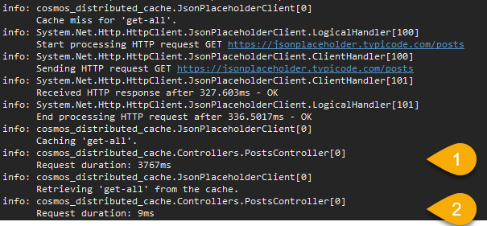

# Cosmos Distributed Cache

This is a simple ASP.NET Core API being used to test using Cosmos as a distributed cache. Packages and resources being used include:

- [Microsoft.Extensions.Caching.Cosmos](https://github.com/Azure/Microsoft.Extensions.Caching.Cosmos)
- [Polly.Caching.IDistributedCache](https://github.com/App-vNext/Polly.Caching.IDistributedCache)
- [JSONPlaceholder](https://jsonplaceholder.typicode.com/)

# Setup

To run the API locally, you'll need to install the Cosmos DB emulator, which you can get [here](https://docs.microsoft.com/en-us/azure/cosmos-db/local-emulator).

Alternatively - set up a real Cosmos DB instance and update ***appsettings.Development.json*** accordingly :sunglasses:

# Testing

There are two endpoints available:

- /api/posts
- /api/posts/{id:int}

Initial requests will call out to an external endpoint for data and there responses will be cached. Subsequent requests will be retrieved from cache, which expires after 1 minute.

